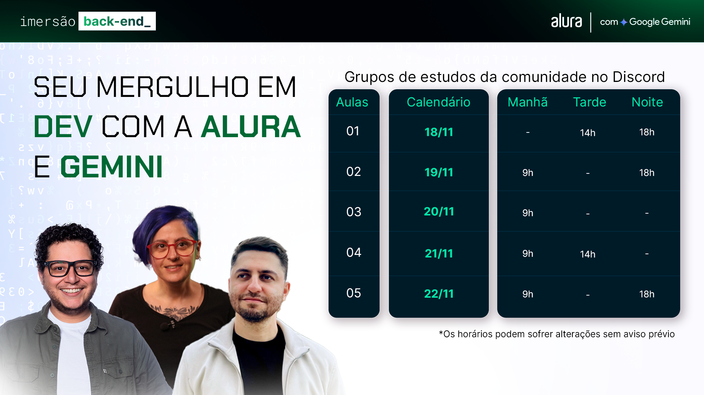

# 🤿 Imersão Dev_ Back-end | Alura + Gemini 

## 📷 Projeto: Instabytes 

Projeto de um servidor back-end de um blog de fotos desenvolvido durante a [Imersão Dev Back-end](https://cursos.alura.com.br/imersao) da [Alura](https://www.alura.com.br/) em parceria com o [Google Gemini](https://gemini.google.com/?hl=pt-BR), realizada em novembro de 2024.

### 🎯 Objetivo: 

O foco do projeto foi fazer um sistema back-end responsável por fazer a comunicação entre o front-end e o banco de dados na nuvem. Após isso, tirar o projeto do servidor local e subir em um servidor na nuvem.

### 🛠️ Tecnologias usadas: 
 

 
 

 

### 📚 Conteúdo das aulas 

<h4> AULA #01 - Desvendando APIs e Servidores</h4>

<li>Conhecer o projeto de blog de fotos;</li>
<li>Instalar o Node.js;</li>
<li>Aprender o que é um servidor;</li>
<li>Criar e subir um servidor;</li>
<li>Criar a sua API Key do Gemini.</li>

<h4>AULA #02 - Criando e Estruturando sua Primeira API com GET e Banco de Dados</h4>

<li>Criar uma base de dados;</li>
<li>Criar um mock com ajuda do Gemini;</li>
<li>Armazenar os seus dados;</li>
<li>Adicionar rotas;</li>
<li>Utilizar o bancos de dados MongoDB;</li>
<li>Preparar o MongoDB para subir o recurso na Nuvem;</li>

<h4>AULA #03 - Conectando sua API ao MongoDB: Estrutura, Conexão e Refatoração</h4>

<li>Configurar o primeiro Cluster, Database e coleção no MongoDB;</li>
<li>Criar variáveis de ambiente;</li>
<li>Conectar o Banco com a API via String de conexão;</li>
<li>Criar código de configuração do banco na API;</li>
<li>Refatoração do primeiro <code>GET</code>;</li>

<h4>AULA #04 - Implementando Armazenamento e Upload de Imagens</h4>

<li>Enviar informações para a sua base de dados;</li>
<li>Aprender sobre verbos HTTP;</li>
<li>Criar a rota <code>POST/post</code> e <code>POST/upload</code>;</li>
<li>Implementar o upload de imagens;</li>
<li>Testar a API com thunderClient e Postman;</li>

<h4>AULA #05 - Publicando na Google Cloud: Configuração de API e Integração com Gemini</h4>

<li>Fazer a lógica de armazenamento de imagens no servidor;</li>
<li>Criar a rota <code>PUT</code> para atualização de post;</li>
<li>Integrar com o Frontend;</li>
<li>Integrar com a API do Gemini;</li>
<li>Fazer o deploy do back-end na Google Cloud.</li>

## 🧑‍💻 Desenvolvido por: 

**Wellington Morais | [Perfil no GitHub](https://github.com/wellingtonmnf)**

* **Deploy: 25/11/2024**
* **Última atualização: 26/11/2024**
